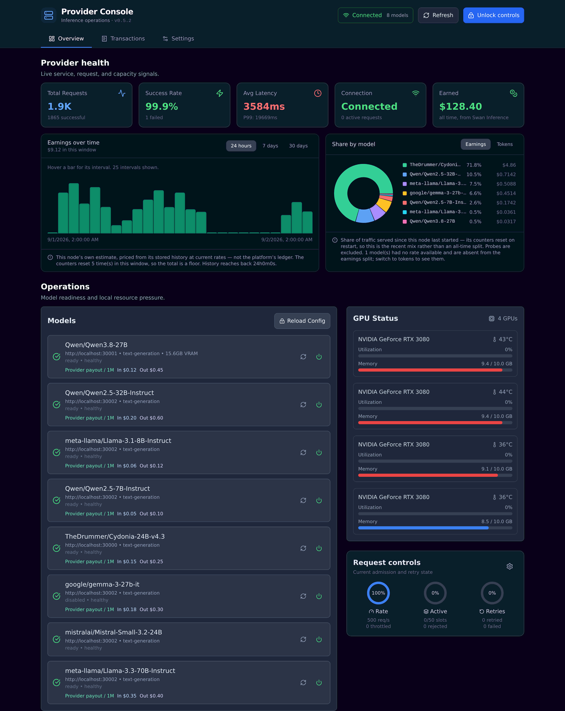

# Computing Provider v2

[](https://discord.gg/Jd2BFSVCKw)
[](https://twitter.com/swan_chain)

Turn your GPU into an AI inference endpoint and join the Swan Chain decentralized computing network.



<sub>The built-in dashboard — `computing-provider dashboard`. Model names, payout rates, and earnings figures are example values.</sub>

**No wallet needed. No blockchain registration. No public IP required.** The
provider dials out to Swan Inference over a WebSocket, so it works behind NAT.

---

## Quick start

### 1. Install

```bash
# Linux x86-64 — also computing-provider-linux-arm64, computing-provider-darwin-arm64
curl -fL -o computing-provider \
  https://github.com/swanchain/computing-provider/releases/latest/download/computing-provider-linux-amd64
chmod +x computing-provider && sudo mv computing-provider /usr/local/bin/

computing-provider version
```

Building from source is optional — see
[installation.md](docs/installation.md#building-from-source).

### 2. Start a model server

**Linux (NVIDIA GPU)** — needs Docker with the
[NVIDIA Container Toolkit](docs/installation.md#install-nvidia-container-toolkit):

```bash
computing-provider models download Qwen/Qwen2.5-7B-Instruct

docker run -d --gpus all -p 30000:30000 --ipc=host --name sglang \
  -v ~/.swan/models/Qwen/Qwen2.5-7B-Instruct:/models \
  lmsysorg/sglang:latest \
  python3 -m sglang.launch_server --model-path /models \
    --host 0.0.0.0 --port 30000 \
    --served-model-name Qwen/Qwen2.5-7B-Instruct
```

**macOS (Apple Silicon)**:

```bash
brew install ollama
ollama serve &
ollama pull qwen2.5:7b
```

### 3. Set up and run

```bash
computing-provider setup             # auth, config, and model discovery
computing-provider run               # start serving
computing-provider inference status  # confirm you are connected
```

The wizard checks prerequisites, creates or logs into your Swan Inference
account, discovers the model servers you just started, matches them to catalog
model IDs, and writes `config.toml` and `models.json`. Start your model server
**before** running it, or it will have nothing to find.

> **Earnings come from traffic, not hardware.** Qwen 2.5 7B is only an example.
> Serving models with demand and few providers routes more requests to you —
> `computing-provider inference recommend-models` ranks the catalog against your
> GPU. See [models.md](docs/models.md).

---

## What happens after setup

Your provider moves through these stages on its own. Most are fully active
within a day.

```
Connect ──▶ Benchmark ──▶ Approval ──▶ Collateral ──▶ Active
(instant)   (automatic)   (< 24 hrs)   (USD or crypto) (earning)
```

| Stage | What happens | Time |
|-------|-------------|------|
| **Connect** | Provider connects to the network and registers its models | Immediate |
| **Benchmark** | Automated benchmarks verify your GPU can serve the registered models | Minutes (automatic) |
| **Approval** | Admin reviews your provider | < 24 hours |
| **Collateral** | Deposit collateral to secure your position and unlock earnings (card, USDC on Ethereum or Base, or SWAN on Swan Chain) | Instant |
| **Active** | Start receiving inference requests and earning rewards | Ongoing |

> **Grace period:** new providers get 7 days after activation during which
> benchmark failures and low uptime do not affect routing priority, so you have
> time to stabilise your setup.

`computing-provider inference status` shows your current stage at any time.

---

## How it works

```
Swan Inference (Cloud)
        │
        │ WebSocket (outbound connection - works behind NAT)
        ▼
┌───────────────────────┐
│  Computing Provider   │
│  ┌─────────────────┐  │
│  │ Your GPU Server │  │
│  │ (SGLang/Ollama) │  │
│  └─────────────────┘  │
└───────────────────────┘
```

1. The provider connects **outbound** to Swan Inference — no inbound ports
2. It registers the models listed in `models.json`
3. Inference requests arrive over that WebSocket
4. Each is forwarded to your local model server and the response streamed back
5. You are **paid per token** for completed requests

Request flow is managed for you, with no tuning required to run: endpoints are
health-checked continuously and unhealthy ones taken out of routing until they
recover; GPU-aware rate limits and per-model concurrency slots reject excess
work with HTTP 429 rather than overloading the GPU; transient upstream failures
are retried with exponential backoff; `models.json` edits hot-reload; and
SIGTERM/SIGINT drains cleanly. Limits can be retuned at runtime over the
[REST API](#rest-api).

---

## Configuration

Two files, both in `$CP_PATH` (default `~/.swan/computing`), both written by
`computing-provider setup`:

**`models.json`** maps catalog model IDs to your local servers:

```json
{
  "Qwen/Qwen2.5-7B-Instruct": {
    "endpoint": "http://localhost:30000",
    "gpu_memory": 16000,
    "category": "text-generation"
  }
}
```

**`config.toml`** holds provider settings:

```toml
[API]
Port = 8085
NodeName = "my-provider"

[Inference]
Enable = true
WebSocketURL = "wss://inference-ws.swanchain.io"
ApiKey = "sk-prov-xxxxxxxxxxxxxxxxxxxx"   # from https://inference.swanchain.io
Models = ["Qwen/Qwen2.5-7B-Instruct"]
```

Every field, plus alerts, self-check, dashboard and logging settings, is
documented in [configuration.md](docs/configuration.md).

> **Serving from Ollama, llama.cpp, LiteLLM or another proxy?** Set
> `context_length` explicitly in `models.json`. Only vLLM and SGLang expose the
> real window, so otherwise the marketplace advertises the catalog's theoretical
> value and clients send prompts your backend rejects. See
> [context windows](docs/configuration.md#context-windows).

---

## Monitoring

### Self-check

The failures that cost a provider money are quiet: the daemon stays up and looks
healthy while a model earns nothing. `computing-provider selfcheck` audits for
exactly that.

```
  OK   models.json                     8 models mapped
  OK   config/models.json agreement    config.toml and models.json list the same models
  OK   Swan Inference connection       connected
  OK   registered with Swan Inference  all 8 models registered
  OK   model health                    all 8 models healthy
  OK   context window                  reported context matches every backend
 FAIL  inference probe                 openai/gpt-5.5: HTTP 401 authentication token has been invalidated
  OK   traffic                         every model has served requests
  OK   disk space                      /home/you/.swan/computing: 92.1 GB free of 438 GB (78% used)
```

It catches what no error message reveals: a model served but not advertised, a
healthy model never registered upstream, a backend serving less context than you
claim, one that answers health checks but cannot actually serve, a model that has
never been called, and a disk about to fill.

The inference probe sends one `max_tokens: 1` completion per model. It is the
only check that exercises the engine — `GET /v1/models` is answered by most
backends without touching it, so a dead engine or expired API token looks healthy
everywhere else.

It exits non-zero on failure, so it works as a cron or monitoring check
(`--json` for machine-readable output, `--no-inference` to skip the probe). The
daemon runs the same audit every 10 minutes and acts on it: a model whose backend
fails two consecutive probes is **deregistered from Swan Inference** and
re-registered once it serves again — no traffic beats traffic that fails. Only
backend-owned failures count; an over-long client prompt or your own rate limit
never pulls a model, and one you disabled by hand is never switched back on. Tune
it under `[SelfCheck]`, see
[configuration.md](docs/configuration.md#self-check-and-auto-heal).

### Alerts

Point the provider at a webhook, an SMTP server, or both, and it tells you when
something breaks:

```toml
[Alerts]
WebhookURL = "https://hooks.example.com/provider"

[Alerts.Email]
Host = "smtp.gmail.com"
Port = 587
Username = "you@example.com"
To = ["you@example.com"]
```

Keep the password out of `config.toml` — the provider reads `$CP_PATH/.env` at
startup:

```bash
# Gmail, Outlook and Yahoo need an app password, not your login password
umask 077 && printf "SMTP_PASSWORD='your-app-password'\n" > $CP_PATH/.env
computing-provider alerts test    # verify before you need it
```

Alerts fire on a model going unhealthy, a model that passes health checks while
failing most of its requests, a lost connection to Swan Inference, and a failed
self-check — each with a matching recovery event. Passing runs are logged
locally and never sent, so an "all clear" never trains you to ignore it. Payload
and tuning in [configuration.md](docs/configuration.md#alerts).

### Dashboard

```bash
computing-provider dashboard    # http://localhost:3060
```

Real-time metrics, earnings, model pricing, per-transaction token usage, GPU
status, model management and request controls — the page shown at the top of
this README.

It is read-only until you choose **Unlock controls** and paste the token from
`$CP_PATH/dashboard.token`, an owner-only file generated on first run.
Configuration, request limits, alerts, self-check and logging can then be edited
from **Settings**; stored secrets are never sent back to the browser. Host and
port are configurable under `[Dashboard]` — use `0.0.0.0` only on a network you
trust.

### Subscription-backed models

If you serve models through [CLIProxyAPI](docs/guides/cliproxy-computing-provider.md) —
which turns a personal ChatGPT, Claude or Gemini subscription into an
OpenAI-compatible endpoint — the provider can check and renew that backend's
logins for you:

```bash
computing-provider cliproxy status           # account, plan and expiry per credential
computing-provider cliproxy status --probe   # and one real completion per model
computing-provider cliproxy login --device   # re-authenticate; prints a code and a URL
```

`status` reads credential metadata only — never a token — and exits non-zero on
an expired or disabled login, so it works as a cron check.

**Use `--probe`.** A login can be unexpired, enabled, and still rejected by the
subscription upstream, and the proxy answers `/v1/models` from a static list
either way — so the model reports healthy while every request fails. Only a real
completion tells those apart:

```
  expiring  codex   you@example.com (plus)   expires 2026-09-08 (in 128h0m0s)

Live probe
  HTTP 503  gpt-5.5
            auth_unavailable: no auth available (providers=codex, model=gpt-5.5)
```

That credential is not expired. Re-authenticating will not help — check whether
the account still has access.

### REST API

```bash
curl http://localhost:8085/api/v1/computing/inference/metrics
```

| Endpoint | Description |
|----------|-------------|
| `GET /inference/status` | Connection state, active models, what is registered upstream |
| `GET /inference/metrics` | Request counts, latency, GPU stats |
| `GET /inference/metrics/prometheus` | Prometheus format for Grafana |
| `GET /inference/models` | List all models with status |
| `GET /inference/health` | Health of every model |
| `POST /inference/models/:id/enable` | Enable a model |
| `POST /inference/models/:id/disable` | Disable a model |
| `POST /inference/models/reload` | Hot-reload `models.json` |

---

## Getting paid

You are paid **per token, for every request you serve**. Each catalog model
publishes a payout price per 1M input and output tokens; earnings accrue at that
rate and appear in the
[Provider Dashboard](https://inference.swanchain.io/dashboard) and in
`computing-provider inference status`. There is no UBI and no allocation for idle
hardware — the Swan 1.0 UBI program has ended — so traffic is the only thing that
earns.

```bash
computing-provider inference set-beneficiary 0xYourWalletAddress
```

Payouts are requested from the dashboard: minimum $10, flat $1 fee, one request
per chain per hour. Earnings can also be converted into inference credit on the
same account.

**Collateral is required for activation**, not optional. Deposit on-chain (USDC
on Ethereum or Base, SWAN on Swan Chain) or by card; it is refundable with a
7-day waiting period.

```bash
computing-provider inference deposit          # chains, contracts, minimums
computing-provider inference deposit --check  # current collateral status
```

---

## CLI reference

```bash
computing-provider setup                     # interactive setup (recommended)
computing-provider run                       # start the provider
computing-provider selfcheck                 # audit this node
computing-provider dashboard                 # web UI on port 3060

computing-provider version                   # installed build
computing-provider update --check            # is a newer release available?
sudo computing-provider update               # install the newest release

computing-provider inference status          # stage, models, earnings, context
computing-provider inference config          # show inference config
computing-provider inference deposit         # collateral instructions
computing-provider inference recommend-models
computing-provider inference set-beneficiary 0x...

computing-provider models catalog            # supported models
computing-provider models download <id>      # fetch weights
computing-provider models list               # what is on disk

computing-provider cliproxy status --probe   # subscription-backed models: are they serving?
computing-provider cliproxy login --device   # re-authenticate one

computing-provider research hardware         # hardware, GPU info, benchmarks
```

`setup` also takes `--skip-discovery` and `--api-key=sk-prov-xxx`, and has
`discover`, `login` and `signup` subcommands. Full reference in
[docs/cli/](docs/cli/README.md); `--help` works on every command.

Updates are verified against the checksums published with each release and the
binary is replaced atomically. `update` deliberately does **not** restart a
running provider — see
[keeping up to date](docs/installation.md#keeping-up-to-date).

---

## Documentation

| Guide | Covers |
|-------|--------|
| [Installation](docs/installation.md) | Requirements, binary install, building from source, updates |
| [Getting started](docs/getting-started.md) | First run, Linux and macOS walkthroughs |
| [Configuration](docs/configuration.md) | `config.toml`, `models.json`, alerts, self-check, dashboard |
| [Models](docs/models.md) | Catalog, VRAM sizing, downloading weights, switching models |
| [SGLang deployment](docs/sglang-deployment.md) | Running SGLang for inference |
| [SGLang tuning](docs/sglang-best-practices.md) | GPU configs, memory tuning, multi-GPU TP |
| [Apple Silicon](docs/apple-silicon-support.md) | Ollama setup on M-series Macs |
| [CLIProxyAPI](docs/guides/cliproxy-computing-provider.md) | Serving a ChatGPT/Claude subscription as an endpoint |
| [Troubleshooting](docs/troubleshooting.md) | Error reference and FAQ |

## Troubleshooting

Start with `computing-provider selfcheck` — it names the problem more precisely
than the logs will. The two most common:

| Symptom | Cause |
|---------|-------|
| Online but receiving no requests | `--served-model-name`, the `models.json` key, and the catalog ID must all match exactly |
| `invalid provider API key` | Provider keys start with `sk-prov-`; consumer keys (`sk-swan-*`) do not work |

Full error reference and FAQ: [docs/troubleshooting.md](docs/troubleshooting.md).

## Getting help

- [Discord](https://discord.gg/3uQUWzaS7U) — community support
- [GitHub Issues](https://github.com/swanchain/computing-provider/issues) — bug reports
- [docs.swanchain.io](https://docs.swanchain.io) — full documentation

## License

Apache 2.0
